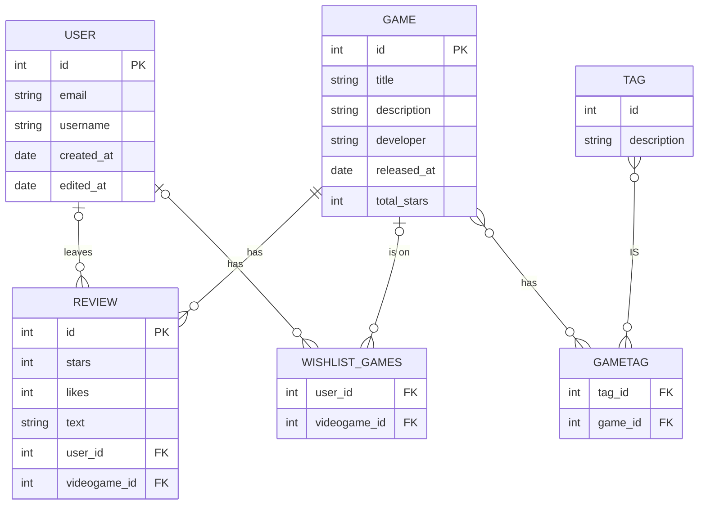
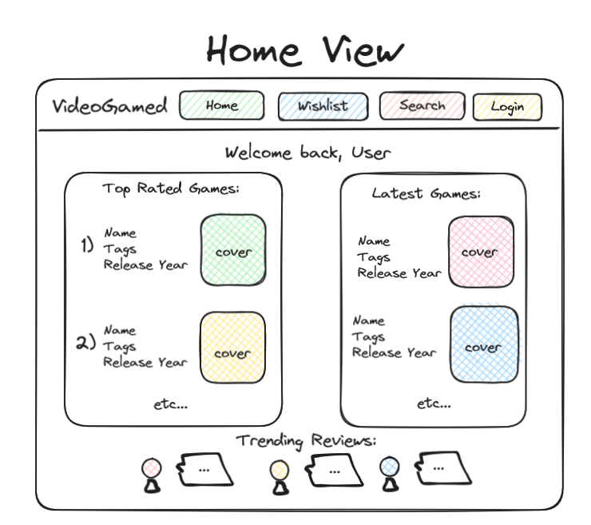
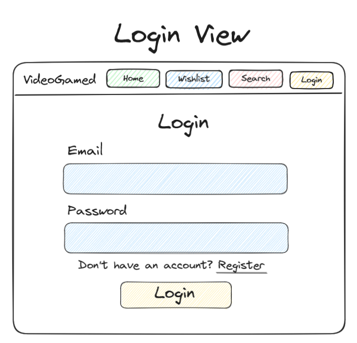
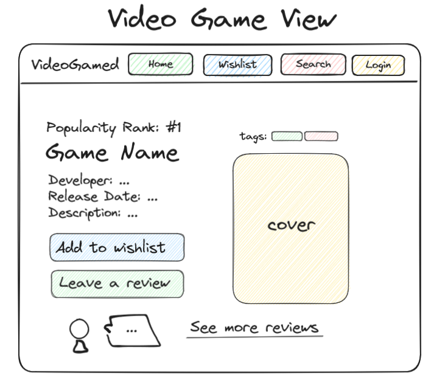
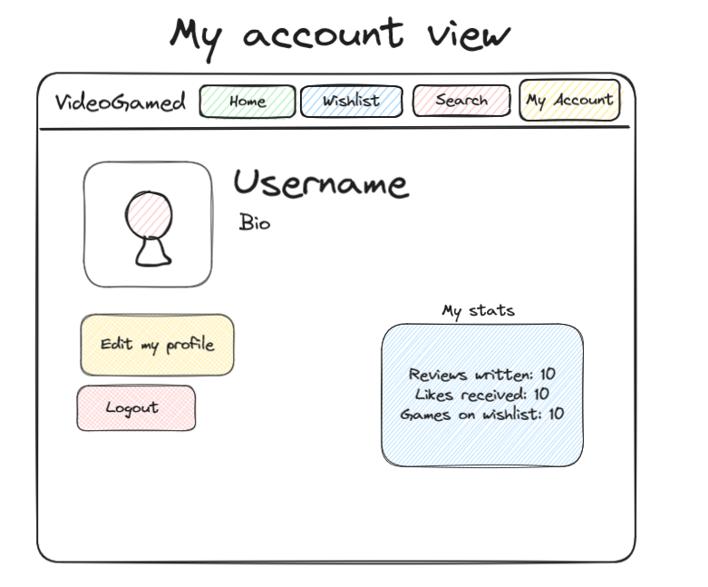
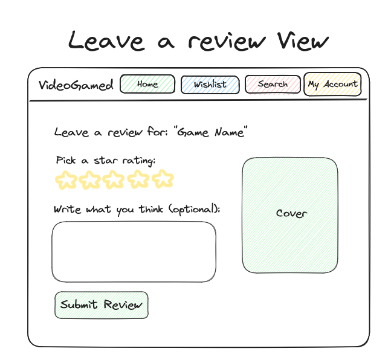
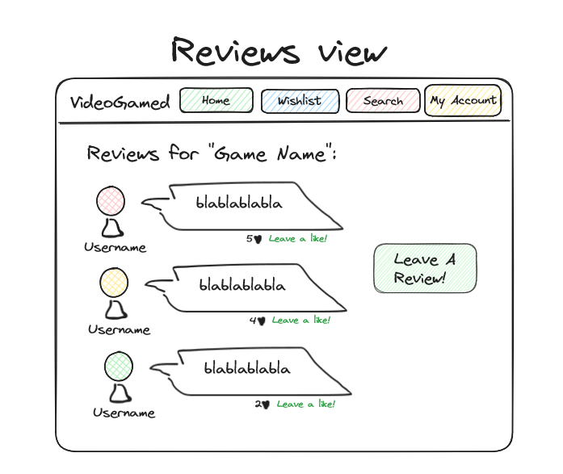
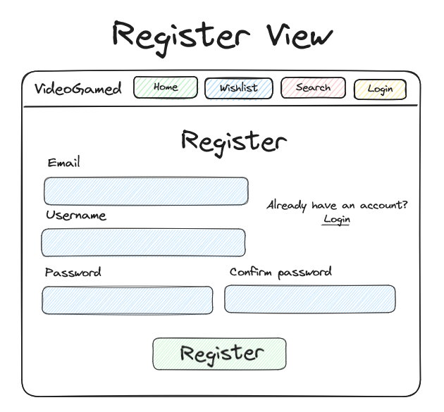
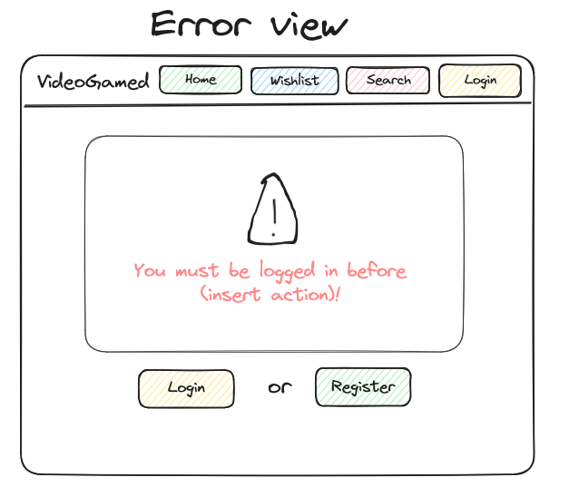

Introducing "VideoGamed" – a platform for gamers to keep track of their favorite video games. Rate the latest games you've played, curate a wishlist and see daily rankings of the most popular video games on the marke! This app is for:

-   New gamers who want to discover new games 
-   Experienced gamers who wish to organize their video game ratings
-   All who wish to meet other gamers and make friends!

Discover new video games, leave ratings and meet new gamer friends with VideoGameTracker!

## 🧱 Core Functionality

-   **Video Game Searching:** Users can search up their favorite game and see it pop up on the screen along with info about it
-   **Video Game Rating:** Users can leave star ratings and reviews on video games they enjoyed (or didn't!)
-   **Video Game Rating:** Users can "like" other user's ratings
-   **Daily Video Game Ranking:** Users can see a daily ranking of the most highly-rated video games!
-   **Latest Video Games:** Users can see the most newly released video games on the market
-   **Wishlist:** Users can add a video game to their wishlist to access it anytime

### Requirements

#### Review Stories

-   As a user, I want to be able to visit a game's page and see an option to leave a review
-   As a user, I want to give a rating out of 5 stars in my review
-   As a user, I want to give a text review in my review
-   As a user, I want to be able to view my reviews to update their content or remove them

#### Video Game Page Stories

-   As a user, I want to visit a video game's page and see info about it (release date, developer)
-   As a user, I want to visit a video game's page and view its ratings
-   As a user, I want to visit a video game's page and view its tags
-   As a user, I want to visit a video game's page and view its popularity ranking
-   As a user, I want to visit a video game's page and view the reviews made from myself and other users

#### User Management Stories

-   As a user, I want to register for an account so I can start using the app.
-   As a user, I want to log in to my account to access my wishlist. 
-   As a user, I want to log out of my account to securely end my session.
-   As a user, I want to be able to edit my username, password, email and profile picture

#### Home Page Stories
-  As a user, I want to be able to search for a specific game in the home page's nav bar
-  As a user, I want the home page to be intuitive to use and for it to be easy to navigate
  

## ᛦ Entity Relationships

>[!note]
> If you view the source code for this README file, you'll see the Mermaid syntax that generated the following diagram. You can copy the code into the [live Mermaid editor](https://mermaid.live) to play around and make changes specific to your app.

-   **Authentication System:** Handling user registration, login, logout, and session management.
-   **Wishlist Management:** Logic for wishlist adding and viewing
-   **Review Management:** Logic for review creation, viewing, and likes
-   **UI Elements:** Design of forms, wish lists, reviews, video game pages.

## 📍 API Routes

>[!note]
> These are only a few routes to give you an idea, these would definitely not be all the routes for this kind of app!

### Review Management

| Request                | Action                           | Response              | Description                                                                     |
| --------------------   | -------------------------------- | --------------------- | --------------------------------------------------------------------------------| 
| POST /review           | ReviewController::createReview   | 201 Gam1ePageView     | Create a new review and redirects to the game's page with the displayed reviews |
| GET /review/:id        | ReviewController::getReview      | 200 ReviewDetails     | Retrieve details of a specific review                                           |
| PUT /review/:id/update | ReviewController::updateReview   | 200 ReviewDetails     | Update a review  and redirects to the updated review                            |
| DELETE /review/:id     | ReviewController::deleteProject  | 204 (No Content)      | Deletes a review                                                                |
| 

### Profile Page Management

| Request                     | Action                           | Response                 | Description                                                   |
| ----------------------------| -------------------------------- | ------------------------ | ----------------------------------------------------------------------------- |
| GET /profile/:profileId     | ProfileController::getProfile    | 200 ProfileView          | Retrieve a profile's details       |
| PUT /profile/:profileId     | ProfileController::updateProfile | 200 ProfileView          | Edit an existing profile           |
| GET /profile/:profileId     | ProfileController:: getProfile   | 404 ErrorView            | The profile DNE         |     
| GET /profile/:profileId     | ProfileController:: getProfile   | 400 BadRequest            | The profile ID is invalid         |      
| GET /profile/:profileId     | ProfileController:: getProfile   | 404 Unauthorized            | The profile ID does not belong to the user, or the user is not logged in   |      

#### Wishlist Page Management
| Request                            | Action                            | Response                 | Description                        |
| -----------------------------------| --------------------------------- | ------------------------ | ---------------------------------- |
| GET /wishlist/:profileId           | WishlistController::getWishList   | 200 TaskDetailView       | Retrieve a wishlist's details      |
| PUT /wishlist/:profileId/:gameId   | WishlistController::updateWishlist| 200 TaskDetailView       | Edit a wishlist                    |

#### User Management

| Request                | Action                           | Response              | Description                                                                    |
| --------------------   | -------------------------------- | --------------------- | -------------------------------------------------------------------------------| 
| POST /users/register   | UserController::createUser       | 201 LoginView         | Create a new user and redirects to the homepage                                |
| POST /users/login      | UserController::loginUser        | 200 HomePage          | Authenticate user details and start a session                                  |
| PUT /users/logout      | UserController::logoutUser       | 200 LoginView         | Logs out a user  and redirects to the login view                               |

## 📐 Wireframes

The home view is the first screen to be revealed to logged in users. It contains a nav bar to go to the wishlist and review pages as well as their account details. On the screen there is a series of game displays such as featured game display, trending, newly added, etc. They can also see a small amount of trending reviews, aka the ones with the most likes. The user also has the option to log out of the site from this view. There is also a search bar so the user can easily find games.

The login view is the initial screen where users can enter their credentials to log into their account. It typically consists of a form with input fields for the username/email and password, along with a "Login" button. The login view should also include a link to the registration page for new users who don't have an account yet.

The video game view/game details view is the view given to each game on the site. It contains an image of the game, the developer, publishing year, the number of accumulated stars from the reviews, the platforms it is available on and a general description of the game itself. Logged in users can add a game to their wishlist, or leave a review . It also has a links to purchase the game.

This account view is a page that can be accessed by a logged in user. They can see a summary of their activity on the site such as number of games reviewed and their wishlist game count. From this page they can also alter their username, email, password or profile picture.

This leave a review view is a screen accessed when the user decides to leave a review for a game. They can leave ratings via stars, add fill out the review's description. The game's title and cover on displayed so the user knowns which 

This reviews view is a view dedicated to showing all the existing reviews for a specific game. The reviews are displayed in a list like fashion and the user is capable of "liking" the review and seeing the username of the person who wrote it.

This register view is accessed via the login view. If a user has not yet created an account, they will need to do so via the register page. They must enter: an email, a username and a password with a confirmation. No other routes besides the login and register view will be available to a user who has not logged in.

This error view is accessed when a user attempts to make an invalid, unauthorized or non-existing action. 

#### Future Add-Ons
If time allows, here are some bonus features that we would like to implement:
-  Lists: allows the user to create curated groups of games such as "cozy games", "classics", etc
-  Have the game view include the current price
-  My Games: Allow the user to mark games as "played" and see them displayed in their profile details. Optionally allow their games to be public.
