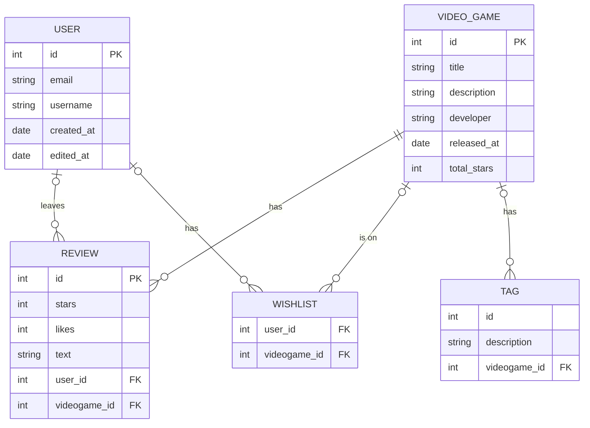

Your [project](https://vikramsinghmtl.github.io/420-4W6-Web-Programming-II/project/specifications) proposal will go here. Since you have to write your proposal in markdown, I've provided the sample proposal below so you have a reference for the syntax. Don't worry about getting rid of my stuff below since there's the live [sample proposal](https://vikramsinghmtl.github.io/420-4W6-Web-Programming-II/project/example-proposal) copy on the notes website.

---

Introducing "VideoGameTracker" – a platform for gamers to keep track of their favorite video games. Rate the latest games you've played, curate a wishlist and see daily rankings of the most popular video games on the marke! This app is for:

-   New gamers who want to discover new games 
-   Experienced gamers who wish to organize their video game ratings
-   All who wish to meet other gamers and make friends!

Discover new video games, leave ratings and meet new gamer friends with VideoGameTracker!

## 🧱 Core Functionality

-   **Video Game Searching:** Users can search up their favorite game and see it pop up on the screen along with info about it
-   **Video Game Rating:** Users can leave star ratings and reviews on video games they enjoyed (or didn't!)
-   **Video Game Rating:** Users can "like" other user's ratings
-   **Daily Video Game Ranking:** Users can see a daily ranking of the most highly-rated video games!
-   **Latest Video Games:** Users can see the most newly released video games on the market
-   **Wishlist:** Users can add a video game to their wishlist to access it anytime

### Requirements

#### Review Stories

-   As a user, I want to be able to visit a game's page and see an option to leave a review
-   As a user, I want to give a rating out of 5 stars in my review
-   As a user, I want to give a text review in my review

#### Video Game Page Stories

-   As a user, I want to visit a video game's page and see info about it (release date, developer)
-   As a user, I want to visit a video game's page and view its ratings
-   As a user, I want to visit a video game's page and view its tags
-   As a user, I want to visit a video game's page and view its popularity ranking

#### User Management Stories

-   As a user, I want to register for an account so I can start using the app.
-   As a user, I want to log in to my account to access my tasks and projects.
-   As a user, I want to log out of my account to securely end my session.

#### Comment Stories

-   As a user, I want to leave a comment on a task to ask for clarification or provide an update.
-   As a user, I want to see comments from other team members on a task to stay on the same page.
-   As a user, I want to be notified if there's a new comment on a task I'm involved with.

#### Status Stories

-   As a user, I want to mark a task as "In Progress" to signal that I'm actively working on it.
-   As a user, I want to mark a task as "Blocked" to indicate that I can't proceed due to a dependency.
-   As a user, I want to view tasks grouped by their status to get a quick overview of the project's health.

## ᛦ Entity Relationships

>[!note]
> If you view the source code for this README file, you'll see the Mermaid syntax that generated the following diagram. You can copy the code into the [live Mermaid editor](https://mermaid.live) to play around and make changes specific to your app.

-   **Authentication System:** Handling user registration, login, logout, and session management.
-   **Project Management:** Logic for project creation, joining projects, and CRUD operations on projects.
-   **Task Management:** Logic for task creation, assignment, updates, filtering, and notifications.
-   **UI Elements:** Design of forms, task lists, project overview, notification lists.

## 📍 API Routes

>[!note]
> These are only a few routes to give you an idea, these would definitely not be all the routes for this kind of app!

### Project Management

| Request              | Action                           | Response              | Description                                                             |
| -------------------- | -------------------------------- | --------------------- | ----------------------------------------------------------------------- |
| POST /projects       | ProjectController::createProject | 201 /projects/:id     | Create a new project and redirect to the project's view                 |
| GET /projects/:id    | ProjectController::getProject    | 200 ProjectDetailView | Retrieve details of a specific project                                  |
| PUT /projects/:id    | ProjectController::updateProject | 200 ProjectDetailView | Update an existing project's information                                |
| DELETE /projects/:id | ProjectController::deleteProject | 204 (No Content)      | Delete a project (consider implications – should tasks be deleted too?) |

### Task Management

| Request                                   | Action                     | Response                 | Description                        |
| ----------------------------------------- | -------------------------- | ------------------------ | ---------------------------------- |
| POST /projects/:projectId/tasks           | TaskController::createTask | 201 /projects/:projectId | Create a new task within a project |
| GET /projects/:projectId/tasks/:taskId    | TaskController::getTask    | 200 TaskDetailView       | Retrieve a specific task's details |
| PUT /projects/:projectId/tasks/:taskId    | TaskController::updateTask | 200 TaskDetailView       | Edit an existing task              |
| DELETE /projects/:projectId/tasks/:taskId | TaskController::deleteTask | 204 (No Content)         | Delete a task                      |

## 📐 Wireframes

The home view is...

The login view is the initial screen where users can enter their credentials to log into their account. It typically consists of a form with input fields for the username/email and password, along with a "Login" button. The login view should also include a link to the registration page for new users who don't have an account yet.

The video game view is...

This account view is... 

This leave a review view is ...

This reviews view is ...

This register view is ...

This error view is ...
