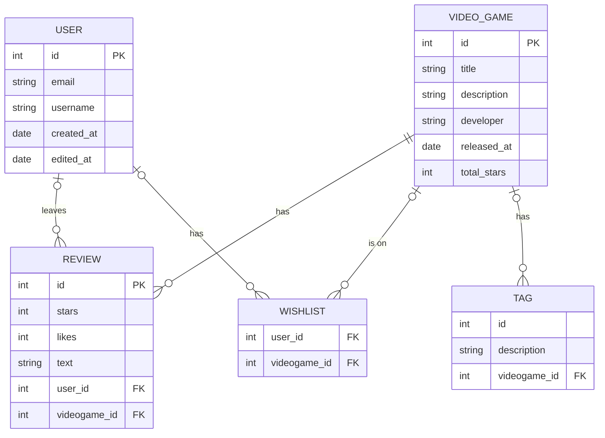

Your [project](https://vikramsinghmtl.github.io/420-4W6-Web-Programming-II/project/specifications) proposal will go here. Since you have to write your proposal in markdown, I've provided the sample proposal below so you have a reference for the syntax. Don't worry about getting rid of my stuff below since there's the live [sample proposal](https://vikramsinghmtl.github.io/420-4W6-Web-Programming-II/project/example-proposal) copy on the notes website.

---

Introducing "VideoGameTracker" – a platform for gamers to keep track of their favorite video games. Rate the latest games you've played, curate a wishlist and see daily rankings of the most popular video games on the marke! This app is for:

-   New gamers who want to discover new games 
-   Experienced gamers who wish to organize their video game ratings
-   All who wish to meet other gamers and make friends!

Discover new video games, leave ratings and meet new gamer friends with VideoGameTracker!

## 🧱 Core Functionality

-   **Video Game Searching:** Users can search up their favorite game and see it pop up on the screen along with info about it
-   **Video Game Rating:** Users can leave star ratings and reviews on video games they enjoyed (or didn't!)
-   **Video Game Rating:** Users can "like" other user's ratings
-   **Daily Video Game Ranking:** Users can see a daily ranking of the most highly-rated video games!
-   **Latest Video Games:** Users can see the most newly released video games on the market
-   **Wishlist:** Users can add a video game to their wishlist to access it anytime

### Requirements

#### Review Stories

-   As a user, I want to be able to visit a game's page and see an option to leave a review
-   As a user, I want to give a rating out of 5 stars in my review
-   As a user, I want to give a text review in my review
-   As a user, I want to be able to view my reviews to update their content or remove them

#### Video Game Page Stories

-   As a user, I want to visit a video game's page and see info about it (release date, developer)
-   As a user, I want to visit a video game's page and view its ratings
-   As a user, I want to visit a video game's page and view its tags
-   As a user, I want to visit a video game's page and view its popularity ranking
-   As a user, I want to visit a video game's page and view the reviews made from myself and other users

#### User Management Stories

-   As a user, I want to register for an account so I can start using the app.
-   As a user, I want to log in to my account to access my tasks and projects.
-   As a user, I want to log out of my account to securely end my session.
-   As a user, I want to be able to edit my username, password and email

#### Home Page Stories
-  As a user, I want to be able to search for a specific game in the home page's nav bar
-  As a user, I want the home page to be intuitive to use and for it to be easy to navigate
  

## ᛦ Entity Relationships

>[!note]
> If you view the source code for this README file, you'll see the Mermaid syntax that generated the following diagram. You can copy the code into the [live Mermaid editor](https://mermaid.live) to play around and make changes specific to your app.

-   **Authentication System:** Handling user registration, login, logout, and session management.
-   **Project Management:** Logic for project creation, joining projects, and CRUD operations on projects.
-   **Task Management:** Logic for task creation, assignment, updates, filtering, and notifications.
-   **UI Elements:** Design of forms, task lists, project overview, notification lists.

## 📍 API Routes

>[!note]
> These are only a few routes to give you an idea, these would definitely not be all the routes for this kind of app!

### Review Management

| Request              | Action                           | Response              | Description                                                             |
| -------------------- | -------------------------------- | --------------------- | ----------------------------------------------------------------------- |
| POST /review       | ProjectController::createReview | 201 GamePageView    | Create a new review and redirects to the game's page with the displayed reviews|
| GET /review/:id    | ProjectController::getProject    | 200 ReviewDetails | Retrieve details of a specific review                                  |
| PUT /review/:id    | ProjectController::updateProject | 200 GamePageView | Update a review  and redirects to the game's page|
| DELETE /review/:id | ProjectController::deleteProject | 204 (No Content)      | Deletes a review  |

### Game Page Management

| Request                                   | Action                     | Response                 | Description                        |
| ----------------------------------------- | -------------------------- | ------------------------ | ---------------------------------- |
| POST /projects/:projectId/tasks           | TaskController::createTask | 201 /projects/:projectId | Create a new task within a project |
| GET /projects/:projectId/tasks/:taskId    | TaskController::getTask    | 200 TaskDetailView       | Retrieve a specific task's details |
| PUT /projects/:projectId/tasks/:taskId    | TaskController::updateTask | 200 TaskDetailView       | Edit an existing task              |
| DELETE /projects/:projectId/tasks/:taskId | TaskController::deleteTask | 204 (No Content)         | Delete a task                      |

## 📐 Wireframes

The home view is the first screen to be revealed to logged in users. It contains a nav bar to go to the wishlist and review pages as well as their account details. On the screen there is a series of game displays such as featured game display, trending, newly added, etc. They can also see a small amount of trending reviews, aka the ones with the most likes. The user also has the option to log out of the site from this view. There is also a search bar so the user can easily find games.

The login view is the initial screen where users can enter their credentials to log into their account. It typically consists of a form with input fields for the username/email and password, along with a "Login" button. The login view should also include a link to the registration page for new users who don't have an account yet.

The video game view is the view given to each game on the site. It contains an image of the game, the developer, publishing year, the number of accumulated stars from the reviews, the platforms it is available on and a general description of the game itself. Logged in users can add a game to their wishlist, or leave a review . It also has a links to purchase the game.

This account view is a page that can be accessed by a logged in user. They can see a summary of their activity on the site such as number of games reviewed and their wishlist game count. From this page they can also alter their username, email or password.

This leave a review view is a screen accessed when the user decides to leave a review for a game.

This reviews view is ...

This register view is ...

This error view is ...
